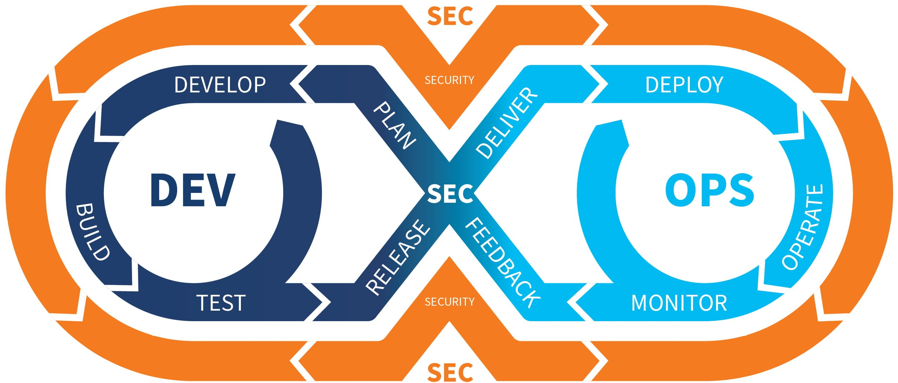

# Hi there, I'm Aziz Aroug! 👋

I'm a passionate software developer with a love for creating innovative solutions. When I'm not coding, you can find me exploring new gaming worlds, embarking on adventures in different corners of the globe, and lending a helping hand to those in need.

## About Me
- 🎓 Graduated with a degree in Computer Engineering.
- 🔭 I’m currently focusing on upgrading skills 👨⌛️

- 💻 Experience with Assessment and Authorization (A&A) in support of DoD and IC programs, including package development, artifact generation, and authority to operate (ATO)

- 💻  Familiarity with differences in on-prem OPSEC in relation to cloud-based security
      • Strong understanding of networking (TCP Flags, TCP Handshake, IP addressing, Firewalls, Proxy, IDS, IPS)
      • Ability to perform NetFlow / packet capture (PCAP) analysis
      • Experience with cyber threat hunting

- 💻 Experienced in DevSecOps with Terraform, Git, Jenkins, Docker, K8S, Ansible,

- 💻 Experienced with Nessus, Nmap, Burp Suite , Metasploit , Wireshark , OWASP ZAP

- 💻 Experienced Threat hunting, PowerShell 

- 💻 Experienced in mobile app development with Flutter and React-Native .For backend development with Firebase, 
SQLITE and Node.js.

- 💻 Experienced in Web development with Reactjs, Angularjs and for the backend with ASP.NET, Django, Node.js and Symfony.

- 🚀 Always seeking new challenges and opportunities for growth.
- 🎨 Creative thinker with a knack for problem-solving.

## Interests
- 🎮 Gaming: I enjoy playing RPGs and strategy games.
- ✈️ Traveling: I love exploring new cultures and cuisines. Next destination: Japan 😄 !
- 🌱 Learning: Lifelong learner with a curiosity for blockchain technology.

## Get in Touch
- 💬 Let's chat! Connect with me on [LinkedIn](https://www.linkedin.com/in/aziz-aroug-a9a026246/).
- 📧 You can also reach out via email at azizaroug.business@outlook.com or aziz.aroug.9@gmail.com

## Fun Fact
- ⚡️ Fun fact: I once built a mini arcade machine from scratch using a Raspberry Pi!
- 🤗 Love to make new connections 👫🐥
- 😄 Fun fact: I have a contagious laugh that can brighten anyone's day!

I'm excited to connect with fellow developers and enthusiasts. Let's build something awesome together!
